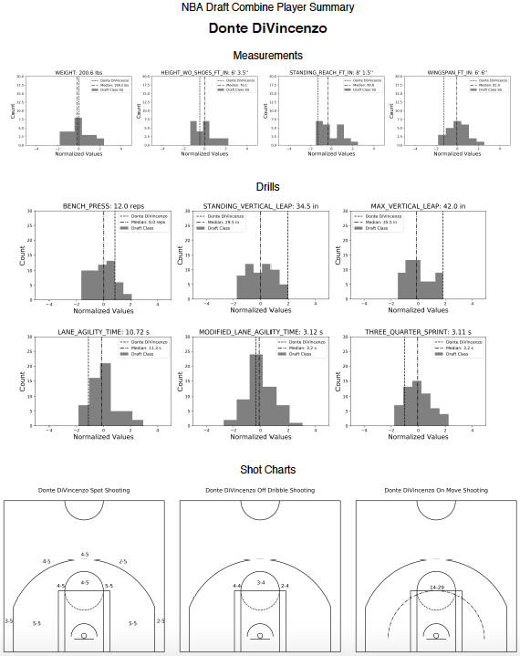

# draft_combine
NBA Draft Combine Analysis

## Description

This repo contains the `draft_combine.ipynb` notebook that explores the `draftcombinestats` endpoint of the [stats.nba.com](https://stats.nba.com) API. With the `Draft` class of the `py_ball` package, the goal of this work is to produce draft sheets summarizing player performance at the draft combine.

## Results

The image below shows the PDF of an example player summary sheet from the 2018 NBA Draft Combine for Donte DiVincenzo. Note the three types of data on the sheet: measurement, drill, and shooting data. A quick skim of the sheet shows that DiVincenzo had the highest standing vertical leap and maximum vertical leap, as well as an impressive spot up shooting performance. The PDF is available for further review in this repo (`donte_divincenzo_summary_sheet.pdf`).

